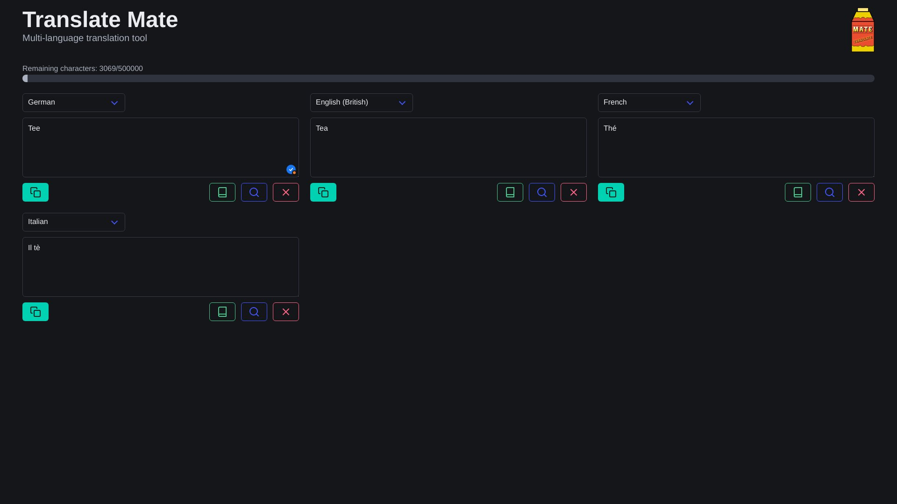

[](LICENSE)


# Translate Mate


**Multi-language translation tool**

Makes translating from and to multiple languages simultaneously refreshing and empowering like an coffein-loaded ice cold mate tea.
Built for manually translating lots of product attributes to different languages, with a focus on usability.

## Features
- **Multi-language support**: Translate between multiple languages simultaneously.
- **DeepL API integration**: Utilizes the DeepL API for high-quality translations.
- **User-friendly interface**: Built with Alpine.js and Bulma for a responsive and intuitive user experience.
- **Dark mode**: Automatically adapts to your system's theme settings.
- **Research translations**: Easily search translated words on google in correct language.
- **Easy clipboard access**: Copy translations to clipboard with a single click.
- **Dictionary**: Show word definitions to help you evaluate the correctness.

## Acknowledgements
- [DeepL API](https://www.deepl.com/pro#developer) for translation
- [Alpine.js](https://alpinejs.dev/) for frontend interactivity
- [Bulma](https://bulma.io/) for styling
- [Free Dictionary API](https://freedictionaryapi.com) for dictionary api

## Disclaimer
This project does not enforce any code quality standards, and it is not intended for production use. It is a personal project that serves as a learning experience and a tool for personal use. The code may contain bugs, and the design may not follow best practices. Some Parts of this project are generated with the help of AI coding tools.

This project is not affiliated with DeepL or any other third-party services. It is an independent tool that utilizes the DeepL API for translation services. Please ensure you comply with the terms of service of any APIs you use.

This software is provided "as is", without warranty of any kind, express or implied.

## Run
### Dev
```bash
cd frontend
npm run dev

cd backend
npm run dev
```

### Prod
First, build the frontend, then start the backend. Alternatively, you may use the docker image, which does this steps automatically.
The frontend needs to be built to `backend/public/` and is published on the `/` route.
```bash
cd backend
node main.js
```

## Build
The frontend gets built to `frontend/dist/` and needs to be moved to `backend/public`.
This step is included in the docker build process

```bash
# Build frontend
cd ./frontent
npm run build

# Generate the containers
docker compose build
```

## Docker
To run the application in a Docker container, you can use the provided `docker-compose.yml` file. Make sure to set the `API_KEY` environment variable in the `docker-compose.yml` file to your DeepL API key.
```bash
docker compose up -d --build
```

## Screenshots

<p>
  
    
</p>

## Future Plans
- Environment Variables for URL
- Implement user authentication to save translation history.
- Posibility to add deepl API key via UI.
- Store translations in a database for faster access and saving on credits.
- Allow users to add more languages via UI.

## FAQ
**Q: How do I set up the DeepL API key?**

A: You can set the `API_KEY` environment variable in the `docker-compose.yml` file or in your `.env` file. See the [getting started section from Deepl docs](https://developers.deepl.com/docs/getting-started/intro) for more details.
